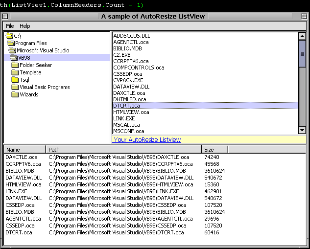



## AutoResize for ListView

### Description

this a sample again of AutoColumnReSize for ListView. i make a code for this coz ive enough pressing CTRL+"+" its killing me.... ("b)
 
### More Info
 

             |
---                |---
**Submitted On**   |2002-08-12 10:49:08
**By**             |[BIOS \[ze0slot\]](https://github.com/Planet-Source-Code/PSCIndex/blob/master/ByAuthor/bios-ze0slot.md)
**Level**          |Intermediate
**User Rating**    |4.3 (17 globes from 4 users)
**Compatibility**  |VB 5\.0, VB 6\.0
**Category**       |[Coding Standards](https://github.com/Planet-Source-Code/PSCIndex/blob/master/ByCategory/coding-standards__1-43.md)
**World**          |[Visual Basic](https://github.com/Planet-Source-Code/PSCIndex/blob/master/ByWorld/visual-basic.md)
**Archive File**   |[AutoResize1170568122002\.zip](https://github.com/Planet-Source-Code/bios-ze0slot-autoresize-for-listview__1-37855/archive/master.zip)

